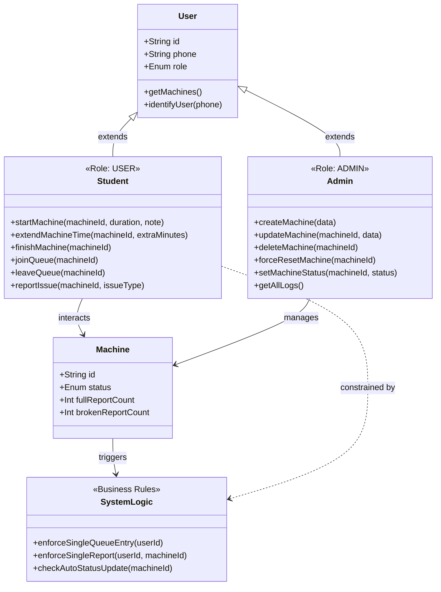

# Rol ve Metod Sınıf Diyagramı (Class Diagram)

Aşağıdaki şema, sistemdeki rollerin hiyerarşisini, sahip oldukları metodları ve Makine (Machine) nesnesi ile olan ilişkilerini göstermektedir. Ayrıca sizin belirlediğiniz iş kuralları (Business Logic) da sisteme dahil edilmiştir.

### Diyagramın Özeti:
1. **Kalıtım (Inheritance):** `Student` ve `Admin` sınıfları temel `User` sınıfından türer (extends). Yani her ikisi de makineleri görüntüleyebilir.
2. **Kısıtlamalar:** `Student`, `SystemLogic` tarafından kısıtlanır (örneğin birden fazla sıraya giremez).
3. **Otomasyon:** `Machine` üzerinde yapılan raporlamalar `SystemLogic`'i tetikler ve rapor sayısına göre makinenin durumunu otomatik günceller.
