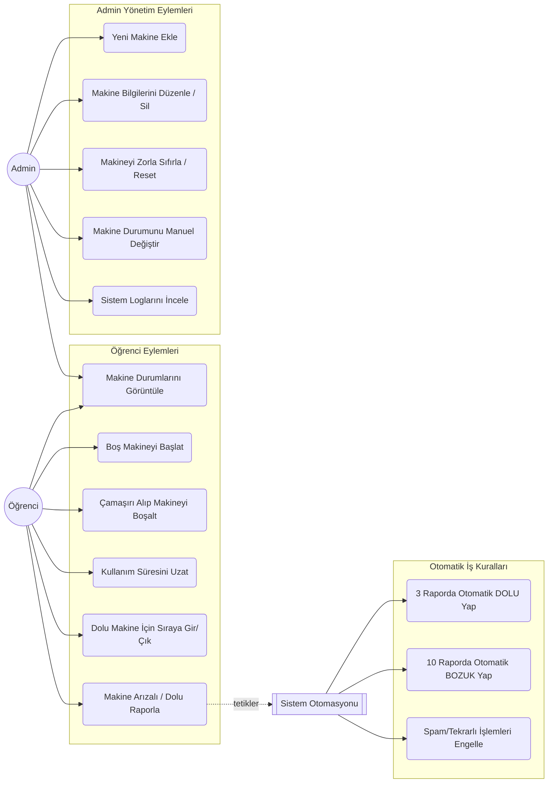

# Kullanım Senaryosu Diyagramı (Use Case Diagram)

Bu diyagram, sistemdeki aktörlerin (Öğrenci, Admin ve Sistem Otomasyonu) hangi eylemleri gerçekleştirebildiğini gösterir.

### Diyagramın Özeti:
1. **Öğrenci (User):** Temel makine kullanım, sıraya girme ve raporlama eylemlerini gerçekleştirir.
2. **Admin:** Sistemi denetleme, makine yönetimi ve zorunlu müdahale haklarına sahiptir.
3. **Sistem Otomasyonu:** Öğrencilerin gönderdiği raporları arka planda dinler. Spam kısıtlamalarını uygular ve eşik değerlere (3 ve 10) ulaşıldığında makine durumunu kimseye sormadan günceller.
